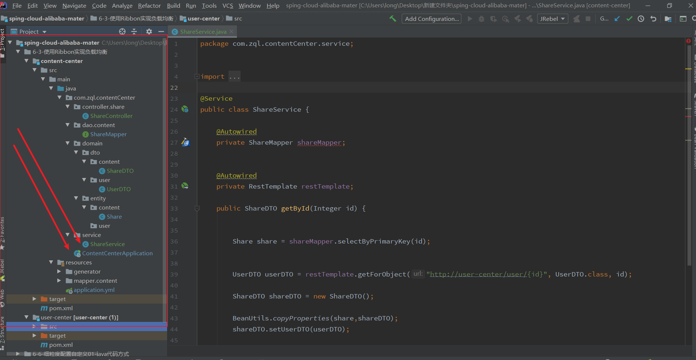

---

title: 6-03-使用Ribbon实现负载均衡
date: 2020-05-07 23:04:47
description: # 描述
tags: 
  - Spring Cloud alibaba 基础学习
---

暂无说明

<!-- more -->

#### 1. 项目目录



#### 2. 加注释

````
package com.zql.contentCenter;

import org.springframework.boot.SpringApplication;
import org.springframework.boot.autoconfigure.SpringBootApplication;
import org.springframework.cloud.client.loadbalancer.LoadBalanced;
import org.springframework.context.annotation.Bean;
import org.springframework.web.client.RestTemplate;
import tk.mybatis.spring.annotation.MapperScan;

@MapperScan("com.zql")
@SpringBootApplication
public class ContentCenterApplication {

    public static void main(String[] args) {

        SpringApplication.run(ContentCenterApplication.class, args);
    }

    @Bean
    @LoadBalanced
    public RestTemplate restTemplate() {

        return new RestTemplate();
    }
}

````


#### 3. 修改代码

**原始代码**

````
package com.zql.contentCenter.service;


import com.zql.contentCenter.dao.content.ShareMapper;
import com.zql.contentCenter.domain.dto.content.ShareDTO;
import com.zql.contentCenter.domain.dto.user.UserDTO;
import com.zql.contentCenter.domain.entity.content.Share;
import org.springframework.beans.BeanUtils;
import org.springframework.beans.factory.annotation.Autowired;
import org.springframework.cloud.client.ServiceInstance;
import org.springframework.cloud.client.discovery.DiscoveryClient;
import org.springframework.stereotype.Service;
import org.springframework.web.client.RestTemplate;

import java.net.URI;
import java.util.List;
import java.util.Optional;
import java.util.concurrent.ThreadLocalRandom;
import java.util.stream.Collector;
import java.util.stream.Collectors;
import java.util.stream.Stream;

@Service
public class ShareService {

    @Autowired
    private ShareMapper shareMapper;

    @Autowired
    private DiscoveryClient discoveryClient;

    @Autowired
    private RestTemplate restTemplate;

    public ShareDTO getById(Integer id) {


        Share share = shareMapper.selectByPrimaryKey(id);

        List<ServiceInstance> instances = discoveryClient.getInstances("user-center");
        List<String> urlList = instances.stream().map(instance -> instance.getUri().toString() + "/user/{id}").collect(Collectors.toList());

        int i = ThreadLocalRandom.current().nextInt(urlList.size());


        UserDTO userDTO = restTemplate.getForObject(urlList.get(i), UserDTO.class, id);

        ShareDTO shareDTO = new ShareDTO();

        BeanUtils.copyProperties(share,shareDTO);
        shareDTO.setUserDTO(userDTO);

        return shareDTO;


    }
}

````


**修改后代码**

````
package com.zql.contentCenter.service;


import com.zql.contentCenter.dao.content.ShareMapper;
import com.zql.contentCenter.domain.dto.content.ShareDTO;
import com.zql.contentCenter.domain.dto.user.UserDTO;
import com.zql.contentCenter.domain.entity.content.Share;
import org.springframework.beans.BeanUtils;
import org.springframework.beans.factory.annotation.Autowired;
import org.springframework.cloud.client.ServiceInstance;
import org.springframework.cloud.client.discovery.DiscoveryClient;
import org.springframework.stereotype.Service;
import org.springframework.web.client.RestTemplate;

import java.net.URI;
import java.util.List;
import java.util.Optional;
import java.util.concurrent.ThreadLocalRandom;
import java.util.stream.Collector;
import java.util.stream.Collectors;
import java.util.stream.Stream;

@Service
public class ShareService {

    @Autowired
    private ShareMapper shareMapper;


    @Autowired
    private RestTemplate restTemplate;

    public ShareDTO getById(Integer id) {


        Share share = shareMapper.selectByPrimaryKey(id);


        UserDTO userDTO = restTemplate.getForObject("http://user-center/user/{id}", UserDTO.class, id);

        ShareDTO shareDTO = new ShareDTO();

        BeanUtils.copyProperties(share,shareDTO);
        shareDTO.setUserDTO(userDTO);

        return shareDTO;

    }
}

````

