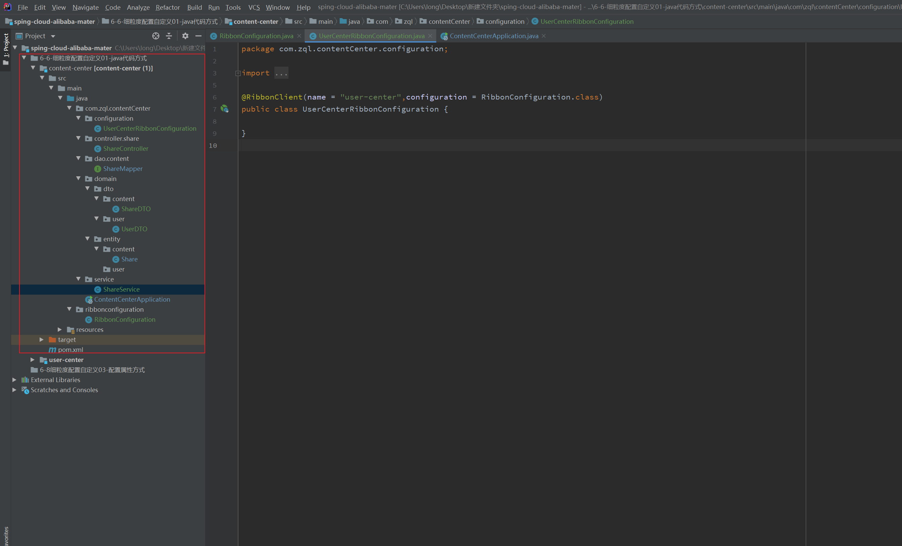

---

title: 6-06-细粒度配置自定义01-java代码方式
date: 2020-05-07 23:04:47
description: # 描述
tags: 
  - Spring Cloud alibaba 基础学习
---

暂无说明

<!-- more -->

#### 1. 项目目录



#### 2. 创建Ribbon配置类

````
package ribbonconfiguration;

import com.netflix.loadbalancer.IRule;
import com.netflix.loadbalancer.RandomRule;
import org.springframework.context.annotation.Bean;
import org.springframework.context.annotation.Configuration;

@Configuration
public class RibbonConfiguration {

    @Bean
    public IRule ribbonRule() {

        return new RandomRule();
    }
}

````


## 2. 创建user-center Ribbon配置类

````
package com.zql.contentCenter.configuration;

import org.springframework.cloud.netflix.ribbon.RibbonClient;
import ribbonconfiguration.RibbonConfiguration;

@RibbonClient(name = "user-center",configuration = RibbonConfiguration.class)
public class UserCenterRibbonConfiguration {
    
}

````


