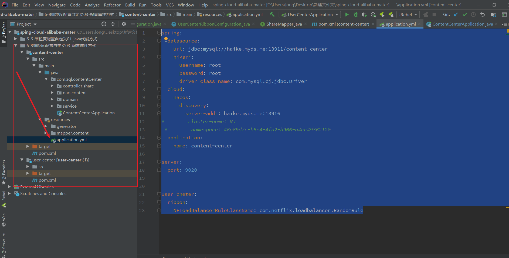

---

title: 6-08-细粒度配置自定义03-配置属性方式
date: 2020-05-07 23:04:47
description: # 描述
tags: 
  - Spring Cloud alibaba 基础学习
---

暂无说明

<!-- more -->

#### 1.项目目录



#### 2. 配置文件修改

````
spring:
  datasource:
    url: jdbc:mysql://haike.myds.me:13911/content_center
    hikari:
      username: root
      password: root
      driver-class-name: com.mysql.cj.jdbc.Driver
  cloud:
    nacos:
      discovery:
        server-addr: haike.myds.me:13916
#        cluster-name: NJ
 #        namespace: 46a69d7c-b8e4-4fa2-b906-a4cc49362120
  application:
    name: content-center

server:
  port: 9020


user-cneter:
  ribbon:
    NFLoadBalancerRuleClassName: com.netflix.loadbalancer.RandomRule
````


