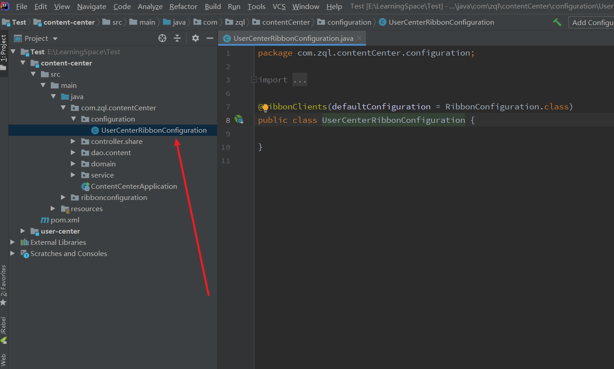

---

title: 6-11-全局配置
date: 2020-05-07 23:04:47
description: # 描述
tags: 
  - Spring Cloud alibaba 基础学习
---

暂无说明

<!-- more -->

#### 1. 项目目录



#### 2. 修改配置类UserCenterRibbonConfiguration

````
package com.zql.contentCenter.configuration;

import org.springframework.cloud.netflix.ribbon.RibbonClient;
import org.springframework.cloud.netflix.ribbon.RibbonClients;
import ribbonconfiguration.RibbonConfiguration;

@RibbonClients(defaultConfiguration = RibbonConfiguration.class)
public class UserCenterRibbonConfiguration {

}

````

