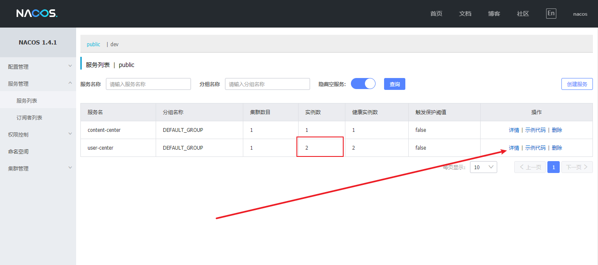
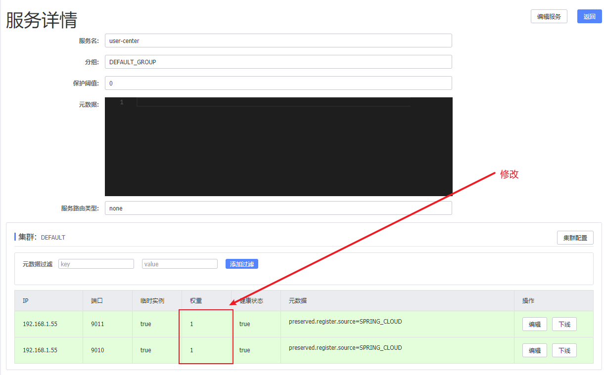
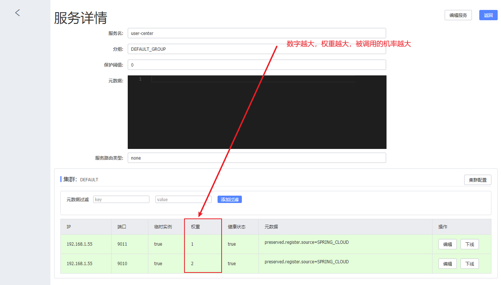
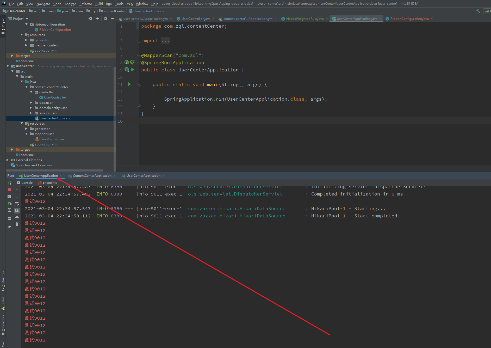
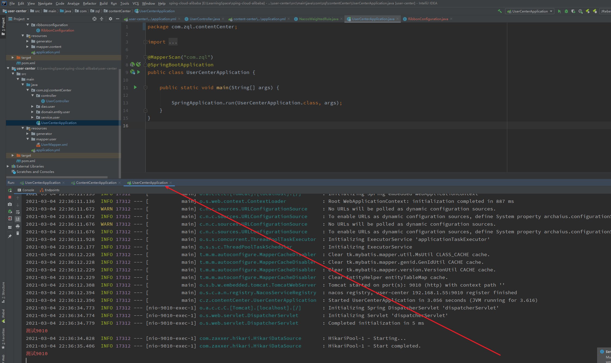

---

title: 6-14-扩展Ribbon-支持Nacos权重
date: 2020-05-07 23:04:47
description: # 描述
tags: 
  - Spring Cloud alibaba 基础学习
---

暂无说明

<!-- more -->

## 1. 配置Nacos，修改服务提供者权重








## 2. 创建Nacos权重配置类

````
package com.zql.contentCenter.configuration;


import com.alibaba.nacos.api.exception.NacosException;
import com.alibaba.nacos.api.naming.NamingService;
import com.alibaba.nacos.api.naming.pojo.Instance;
import com.netflix.client.config.IClientConfig;
import com.netflix.loadbalancer.*;
import org.springframework.beans.factory.annotation.Autowired;
import org.springframework.cloud.alibaba.nacos.NacosDiscoveryProperties;
import org.springframework.cloud.alibaba.nacos.ribbon.NacosServer;

public class NacosWeightedRule extends AbstractLoadBalancerRule {


    @Autowired
    private NacosDiscoveryProperties nacosDiscoveryProperties;

    @Override
    public void initWithNiwsConfig(IClientConfig iClientConfig) {

    }

    @Override
    public Server choose(Object o) {


        try {

            BaseLoadBalancer loadBalancer = (BaseLoadBalancer) this.getLoadBalancer();
            //想要请求的微服务的名称
            String name = loadBalancer.getName();
            //拿到服务发现的相关API
            NamingService namingService = nacosDiscoveryProperties.namingServiceInstance();

            //nacos client自动通过基于权重的负载均衡算法，返回一个实例
            Instance instance = namingService.selectOneHealthyInstance(name);

            return new NacosServer(instance);
        } catch (NacosException e) {
            e.printStackTrace();
        }

        return null;

    }
}
````


## 3. 修改RibbonConfiguration文件

````
package ribbonconfiguration;

import com.netflix.loadbalancer.IRule;
import com.netflix.loadbalancer.RandomRule;
import com.zql.contentCenter.configuration.NacosWeightedRule;
import org.springframework.context.annotation.Bean;
import org.springframework.context.annotation.Configuration;

@Configuration
public class RibbonConfiguration {

    @Bean
    public IRule ribbonRule() {

        //return new RandomRule();
        return new NacosWeightedRule();
    }
}

````


## 4.调用测试，9012端口被更多次调用



