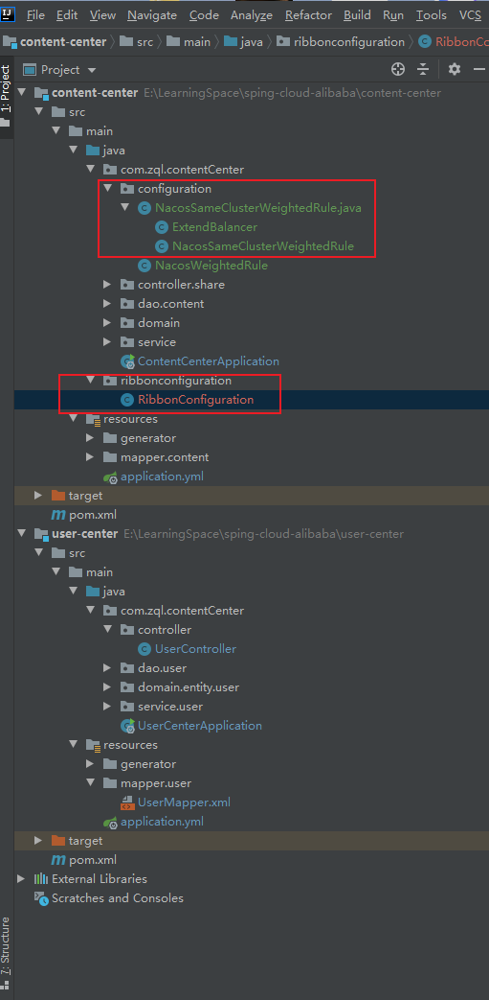
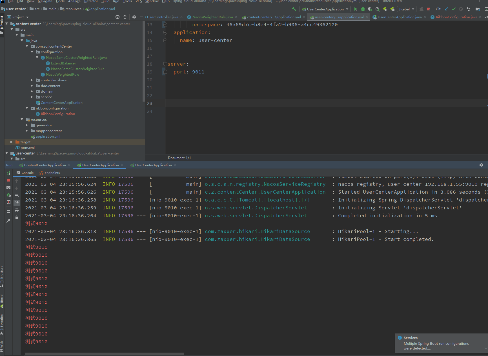
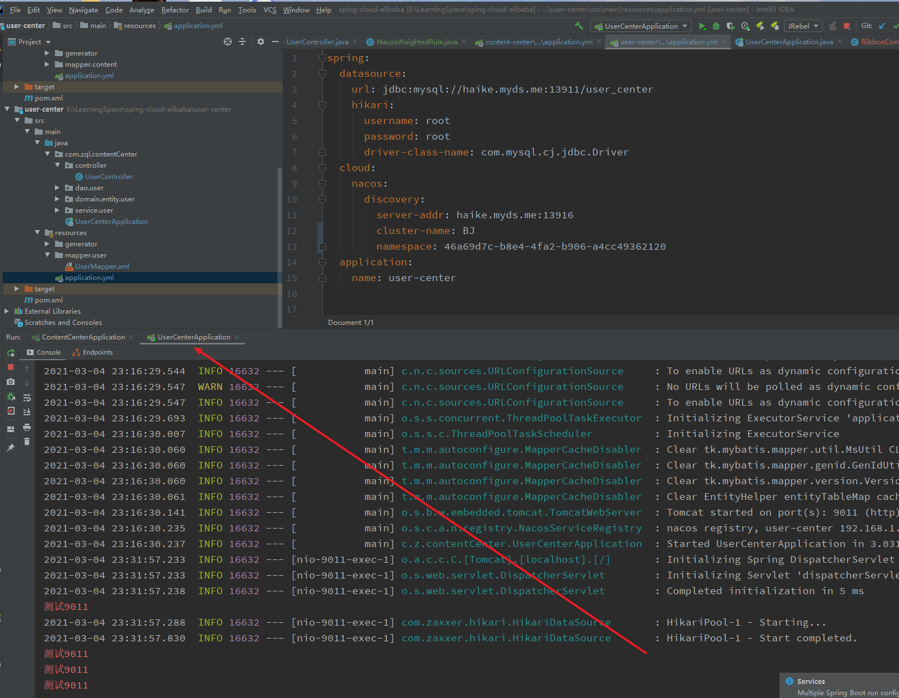

---

title: 6-15-扩展Ribbon-同一集群优先调用
date: 2020-05-07 23:04:47
description: # 描述
tags: 
  - Spring Cloud alibaba 基础学习
---

暂无说明

<!-- more -->

## 1. 文件目录




## 2. 添加配置文件NacosSameClusterWeightedRule

````java
package com.zql.contentCenter.configuration;

import com.alibaba.nacos.api.exception.NacosException;
import com.alibaba.nacos.api.naming.NamingService;
import com.alibaba.nacos.api.naming.pojo.Instance;
import com.alibaba.nacos.client.naming.core.Balancer;
import com.netflix.client.config.IClientConfig;
import com.netflix.loadbalancer.AbstractLoadBalancerRule;
import com.netflix.loadbalancer.BaseLoadBalancer;
import com.netflix.loadbalancer.Server;
import lombok.extern.slf4j.Slf4j;
import org.springframework.beans.factory.annotation.Autowired;
import org.springframework.cloud.alibaba.nacos.NacosDiscoveryProperties;
import org.springframework.cloud.alibaba.nacos.ribbon.NacosServer;
import org.springframework.util.CollectionUtils;

import java.util.ArrayList;
import java.util.List;
import java.util.Objects;
import java.util.stream.Collectors;

@Slf4j
public class NacosSameClusterWeightedRule extends AbstractLoadBalancerRule {

    @Autowired
    private NacosDiscoveryProperties nacosDiscoveryProperties;

    @Override
    public void initWithNiwsConfig(IClientConfig iClientConfig) {

    }

    @Override
    public Server choose(Object o) {

        //1. 找到指定服务的所有实例 A
        //2. 过滤出相同集群下的所有实例 B
        //3. 如果B是空，就用A
        //4. 基于权重的负载均衡
        try {

            //拿到配置文件中集群名称
            String clusterName = nacosDiscoveryProperties.getClusterName();
            BaseLoadBalancer loadBalancer = (BaseLoadBalancer) this.getLoadBalancer();
            //想要请求的微服务的名称
            String name = loadBalancer.getName();
            //拿到服务发现的相关API
            NamingService namingService = nacosDiscoveryProperties.namingServiceInstance();
            // 1. 找到指定服务的所有实例 A
            List<Instance> instances = namingService.selectInstances(name, true);
            // 2. 过滤出相同集群下的所有实例 B
            List<Instance> sameClusterInstances = instances.stream().filter(instance -> Objects.equals(instance.getClusterName(), clusterName)).collect(Collectors.toList());
            // 3. 如果B是空，就用A
            List<Instance> instancesToBeChosen = new ArrayList<>();
            if (CollectionUtils.isEmpty(sameClusterInstances)) {
                instancesToBeChosen = instances;
                log.warn("发生跨集群的调用, name = {}, clusterName = {}, instances = {}", name, clusterName, instances);

            } else {
                instancesToBeChosen = sameClusterInstances;
            }
            // 4. 基于权重的负载均衡算法，返回1个实例
            Instance instance = ExtendBalancer.getHostByRandomWeight2(instancesToBeChosen);
            log.info("选择的实例是 port = {}, instance = {}", instance.getPort(), instance);

            return new NacosServer(instance);
        } catch (NacosException e) {
            e.printStackTrace();
        }

        return null;
    }
}

class ExtendBalancer extends Balancer {
    public static Instance getHostByRandomWeight2(List<Instance> hosts) {
        return getHostByRandomWeight(hosts);
    }
}
````

## 3. 修改配置文件

````java
package ribbonconfiguration;

import com.netflix.loadbalancer.IRule;
import com.netflix.loadbalancer.RandomRule;
import com.zql.contentCenter.configuration.NacosSameClusterWeightedRule;
import com.zql.contentCenter.configuration.NacosWeightedRule;
import org.springframework.context.annotation.Bean;
import org.springframework.context.annotation.Configuration;

@Configuration
public class RibbonConfiguration {

    @Bean
    public IRule ribbonRule() {

        //return new RandomRule();
        return new NacosSameClusterWeightedRule();
    }
}

````

## 4. 修改content-center 项目application.yml文件，更改cluster-name，启动项目

````yml
spring:
  datasource:
    url: jdbc:mysql://haike.myds.me:13911/content_center
    hikari:
      username: root
      password: root
      driver-class-name: com.mysql.cj.jdbc.Driver
  cloud:
    nacos:
      discovery:
        server-addr: haike.myds.me:13916
        # 修改为NJ
        cluster-name: NJ
        namespace: 46a69d7c-b8e4-4fa2-b906-a4cc49362120
  application:
    name: content-center

server:
  port: 9020


#user-center:
#  ribbon:
#    NFLoadBalancerRuleClassName: com.netflix.loadbalancer.RandomRule


````

## 5. 修改user-center 项目application.yml文件，更改cluster-name，更改端口，启动项目

````
spring:
  datasource:
    url: jdbc:mysql://haike.myds.me:13911/user_center
    hikari:
      username: root
      password: root
      driver-class-name: com.mysql.cj.jdbc.Driver
  cloud:
    nacos:
      discovery:
        server-addr: haike.myds.me:13916
        cluster-name: NJ
        namespace: 46a69d7c-b8e4-4fa2-b906-a4cc49362120
  application:
    name: user-center


server:
  port: 9010
````

## 6. 修改user-center 项目application.yml文件，,更改cluster-name，更改端口，启动项目

````
spring:
  datasource:
    url: jdbc:mysql://haike.myds.me:13911/user_center
    hikari:
      username: root
      password: root
      driver-class-name: com.mysql.cj.jdbc.Driver
  cloud:
    nacos:
      discovery:
        server-addr: haike.myds.me:13916
        cluster-name: BJ
        namespace: 46a69d7c-b8e4-4fa2-b906-a4cc49362120
  application:
    name: user-center


server:
  port: 9011


````

## 6. 调用结果

- NJ集群和BJ集群都正常，优先调用NJ机房



NJ集群挂掉，BJ集群正常，改为调用BJ机房

