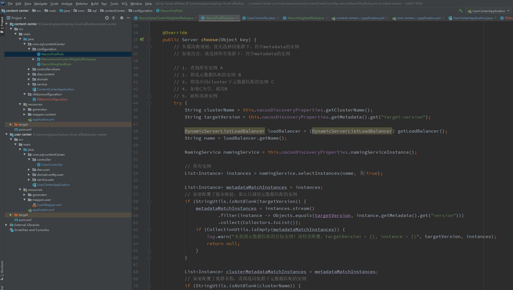

---

title: 6-16-扩展Ribbon-基于元数据的版本控制
date: 2020-05-07 23:04:47
description: # 描述
tags: 
  - Spring Cloud alibaba 基础学习
---

暂无说明

<!-- more -->

## 1. 项目目录




## 2. 创建NacosFinalRule配置类

````
package com.zql.contentCenter.configuration;


import com.alibaba.nacos.api.naming.NamingService;
import com.alibaba.nacos.api.naming.pojo.Instance;
import com.alibaba.nacos.client.naming.utils.CollectionUtils;
import com.alibaba.nacos.client.utils.StringUtils;
import com.netflix.client.config.IClientConfig;
import com.netflix.loadbalancer.AbstractLoadBalancerRule;
import com.netflix.loadbalancer.DynamicServerListLoadBalancer;
import com.netflix.loadbalancer.Server;
import lombok.extern.slf4j.Slf4j;
import org.springframework.beans.factory.annotation.Autowired;
import org.springframework.cloud.alibaba.nacos.NacosDiscoveryProperties;
import org.springframework.cloud.alibaba.nacos.ribbon.NacosServer;

import java.util.List;
import java.util.Objects;
import java.util.stream.Collectors;

@Slf4j
public class NacosFinalRule extends AbstractLoadBalancerRule {


    @Autowired
    private NacosDiscoveryProperties nacosDiscoveryProperties;


    @Override
    public void initWithNiwsConfig(IClientConfig iClientConfig) {

    }

    @Override
    public Server choose(Object key) {
        // 负载均衡规则：优先选择同集群下，符合metadata的实例
        // 如果没有，就选择所有集群下，符合metadata的实例

        // 1. 查询所有实例 A
        // 2. 筛选元数据匹配的实例 B
        // 3. 筛选出同cluster下元数据匹配的实例 C
        // 4. 如果C为空，就用B
        // 5. 随机选择实例
        try {
            String clusterName = this.nacosDiscoveryProperties.getClusterName();
            String targetVersion = this.nacosDiscoveryProperties.getMetadata().get("target-version");

            DynamicServerListLoadBalancer loadBalancer = (DynamicServerListLoadBalancer) getLoadBalancer();
            String name = loadBalancer.getName();

            NamingService namingService = this.nacosDiscoveryProperties.namingServiceInstance();

            // 所有实例
            List<Instance> instances = namingService.selectInstances(name, true);

            List<Instance> metadataMatchInstances = instances;
            // 如果配置了版本映射，那么只调用元数据匹配的实例
            if (StringUtils.isNotBlank(targetVersion)) {
                metadataMatchInstances = instances.stream()
                        .filter(instance -> Objects.equals(targetVersion, instance.getMetadata().get("version")))
                        .collect(Collectors.toList());
                if (CollectionUtils.isEmpty(metadataMatchInstances)) {
                    log.warn("未找到元数据匹配的目标实例！请检查配置。targetVersion = {}, instance = {}", targetVersion, instances);
                    return null;
                }
            }

            List<Instance> clusterMetadataMatchInstances = metadataMatchInstances;
            // 如果配置了集群名称，需筛选同集群下元数据匹配的实例
            if (StringUtils.isNotBlank(clusterName)) {
                clusterMetadataMatchInstances = metadataMatchInstances.stream()
                        .filter(instance -> Objects.equals(clusterName, instance.getClusterName()))
                        .collect(Collectors.toList());
                if (CollectionUtils.isEmpty(clusterMetadataMatchInstances)) {
                    clusterMetadataMatchInstances = metadataMatchInstances;
                    log.warn("发生跨集群调用。clusterName = {}, targetVersion = {}, clusterMetadataMatchInstances = {}", clusterName, targetVersion, clusterMetadataMatchInstances);
                }
            }

            Instance instance = ExtendBalancer.getHostByRandomWeight2(clusterMetadataMatchInstances);
            return new NacosServer(instance);
        } catch (Exception e) {
            log.warn("发生异常", e);
            return null;
        }
    }

}

````


## 3. 修改RibbonConfiguration

````
package ribbonconfiguration;

import com.netflix.loadbalancer.IRule;
import com.netflix.loadbalancer.RandomRule;
import com.zql.contentCenter.configuration.NacosFinalRule;
import com.zql.contentCenter.configuration.NacosSameClusterWeightedRule;
import com.zql.contentCenter.configuration.NacosWeightedRule;
import org.springframework.context.annotation.Bean;
import org.springframework.context.annotation.Configuration;

@Configuration
public class RibbonConfiguration {

    @Bean
    public IRule ribbonRule() {

        //return new RandomRule();
        return new NacosFinalRule();
    }
}

````

## 4. 修改content-center application.yml

````
spring:
  datasource:
    url: jdbc:mysql://haike.myds.me:13911/content_center
    hikari:
      username: root
      password: root
      driver-class-name: com.mysql.cj.jdbc.Driver
  cloud:
    nacos:
      discovery:
        server-addr: haike.myds.me:13916
        # 修改为NJ
        cluster-name: NJ
        namespace: 46a69d7c-b8e4-4fa2-b906-a4cc49362120
        metadata: 
          version: v1
          target-version: v1
  application:
    name: content-center

server:
  port: 9020


#user-center:
#  ribbon:
#    NFLoadBalancerRuleClassName: com.netflix.loadbalancer.RandomRule


````


#### 5. 修改user-center配置文件

````
spring:
  datasource:
    url: jdbc:mysql://haike.myds.me:13911/user_center
    hikari:
      username: root
      password: root
      driver-class-name: com.mysql.cj.jdbc.Driver
  cloud:
    nacos:
      discovery:
        server-addr: haike.myds.me:13916
        cluster-name: BJ
        namespace: 46a69d7c-b8e4-4fa2-b906-a4cc49362120
      metadata:
        version: v1
        target-version: v1
  application:
    name: user-center


server:
  port: 9011


````


