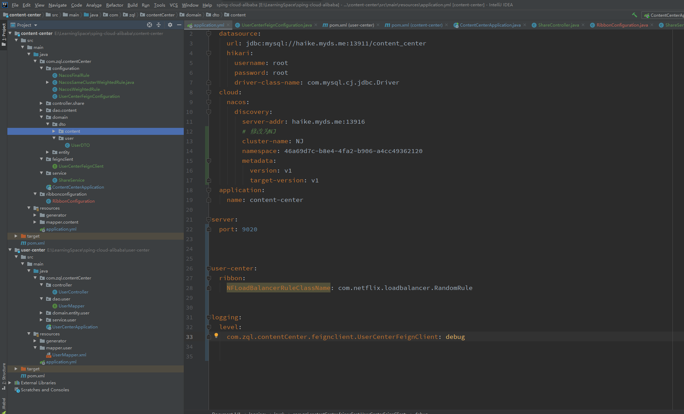

---

title: 7-03-细粒度配置自定义-01-Java代码方式-指定日志级别
date:
description: # 描述
tags: 
  - Spring Cloud alibaba 基础学习
---

暂无说明

<!-- more -->

## 1. 项目结构




## 2. 修改content-center的application.yml文件

````
spring:
  datasource:
    url: jdbc:mysql://haike.myds.me:13911/content_center
    hikari:
      username: root
      password: root
      driver-class-name: com.mysql.cj.jdbc.Driver
  cloud:
    nacos:
      discovery:
        server-addr: haike.myds.me:13916
        # 修改为NJ
        cluster-name: NJ
        namespace: 46a69d7c-b8e4-4fa2-b906-a4cc49362120
        metadata:
          version: v1
          target-version: v1
  application:
    name: content-center

server:
  port: 9020


user-center:
  ribbon:
    NFLoadBalancerRuleClassName: com.netflix.loadbalancer.RandomRule


logging:
  level:
    com.zql.contentCenter.feignclient.UserCenterFeignClient: debug

````

## 2. 新增UserCenterFeignConfiguration类

````
package com.zql.contentCenter.configuration;

import feign.Logger;
import org.springframework.context.annotation.Bean;


public class UserCenterFeignConfiguration {

    @Bean
    public Logger.Level level() {

        return Logger.Level.FULL;
    }
}

````

## 3. 修改UserCenterFeignClient类

````
package com.zql.contentCenter.feignclient;


import com.zql.contentCenter.configuration.UserCenterFeignConfiguration;
import com.zql.contentCenter.domain.dto.user.UserDTO;
import org.springframework.cloud.openfeign.FeignClient;
import org.springframework.web.bind.annotation.GetMapping;
import org.springframework.web.bind.annotation.PathVariable;

@FeignClient(name = "user-center",configuration = UserCenterFeignConfiguration.class)
public interface UserCenterFeignClient {


    @GetMapping("/user/{id}")
    public UserDTO getUser(@PathVariable Integer id);

}

````

