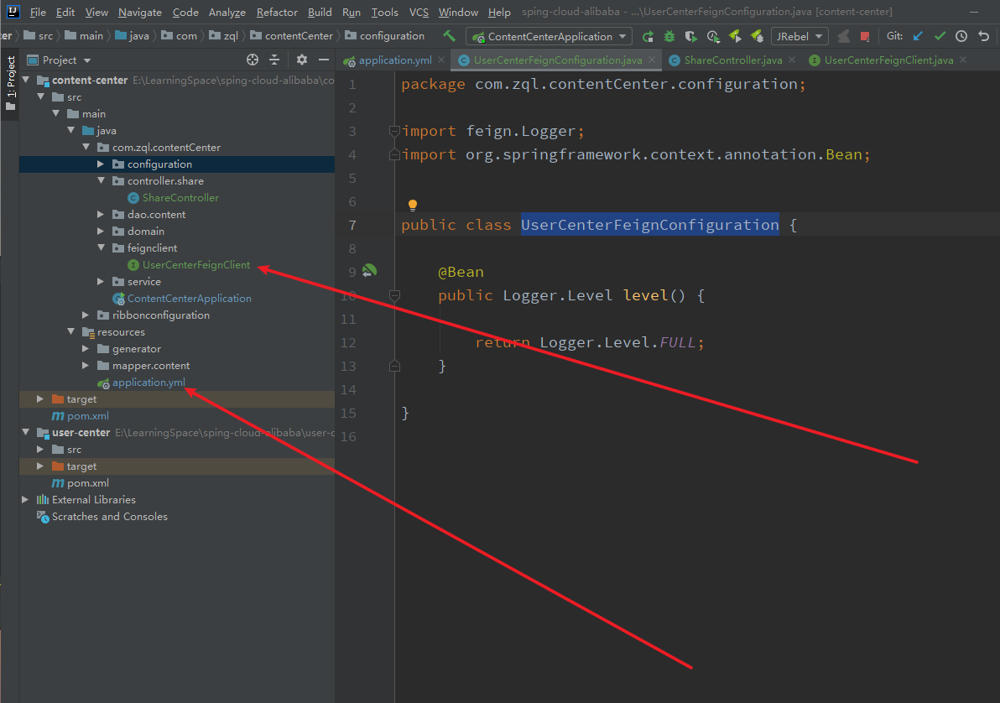

---

title: 7-04-细粒度配置自定义-02-配置属性方式-指定日志级别
date:
description: # 描述
tags: 
  - Spring Cloud alibaba 基础学习
---

暂无说明

<!-- more -->

## 1. 项目目录




## 2.  修改UserCenterFeignClient

````
package com.zql.contentCenter.feignclient;


import com.zql.contentCenter.configuration.UserCenterFeignConfiguration;
import com.zql.contentCenter.domain.dto.user.UserDTO;
import org.springframework.cloud.openfeign.FeignClient;
import org.springframework.web.bind.annotation.GetMapping;
import org.springframework.web.bind.annotation.PathVariable;

//@FeignClient(name = "user-center",configuration = UserCenterFeignConfiguration.class)
@FeignClient(name = "user-center")
public interface UserCenterFeignClient {


    @GetMapping("/user/{id}")
    public UserDTO getUser(@PathVariable Integer id);

}
````

## 3. 修改application.yml

````
spring:
  datasource:
    url: jdbc:mysql://haike.myds.me:13911/content_center
    hikari:
      username: root
      password: root
      driver-class-name: com.mysql.cj.jdbc.Driver
  cloud:
    nacos:
      discovery:
        server-addr: haike.myds.me:13916
        # 修改为NJ
        cluster-name: NJ
        namespace: 46a69d7c-b8e4-4fa2-b906-a4cc49362120
        metadata:
          version: v1
          target-version: v1
  application:
    name: content-center

server:
  port: 9020


user-center:
  ribbon:
    NFLoadBalancerRuleClassName: com.netflix.loadbalancer.RandomRule


logging:
  level:
    com.zql.contentCenter.feignclient.UserCenterFeignClient: debug

feign:
  client:
    config:
      user-center:
        loggerLevel: full
````

