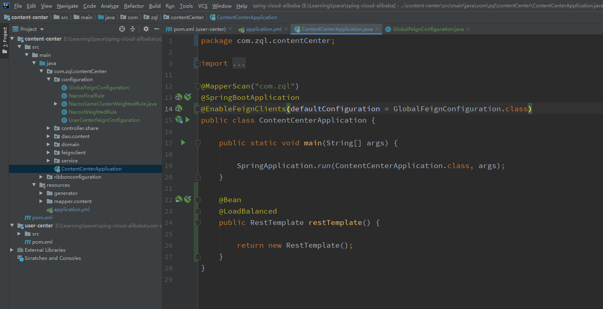

---

title: 7-05-全局配置-01-Java代码方式-指定日志级别
date:
description: # 描述
tags: 
  - Spring Cloud alibaba 基础学习
---

暂无说明

<!-- more -->

## 1. 项目目录



## 2. 修改ContentCenterApplication

````java
package com.zql.contentCenter;

import com.zql.contentCenter.configuration.GlobalFeignConfiguration;
import org.springframework.boot.SpringApplication;
import org.springframework.boot.autoconfigure.SpringBootApplication;
import org.springframework.cloud.client.loadbalancer.LoadBalanced;
import org.springframework.cloud.openfeign.EnableFeignClients;
import org.springframework.context.annotation.Bean;
import org.springframework.web.client.RestTemplate;
import tk.mybatis.spring.annotation.MapperScan;

@MapperScan("com.zql")
@SpringBootApplication
@EnableFeignClients(defaultConfiguration = GlobalFeignConfiguration.class)
public class ContentCenterApplication {

    public static void main(String[] args) {

        SpringApplication.run(ContentCenterApplication.class, args);
    }

    @Bean
    @LoadBalanced
    public RestTemplate restTemplate() {

        return new RestTemplate();
    }
}

````

## 3. 修改application.yml

````
spring:
  datasource:
    url: jdbc:mysql://haike.myds.me:13911/content_center
    hikari:
      username: root
      password: root
      driver-class-name: com.mysql.cj.jdbc.Driver
  cloud:
    nacos:
      discovery:
        server-addr: haike.myds.me:13916
        # 修改为NJ
        cluster-name: NJ
        namespace: 46a69d7c-b8e4-4fa2-b906-a4cc49362120
        metadata:
          version: v1
          target-version: v1
  application:
    name: content-center

server:
  port: 9020


user-center:
  ribbon:
    NFLoadBalancerRuleClassName: com.netflix.loadbalancer.RandomRule


logging:
  level:
    com.zql.contentCenter.feignclient.UserCenterFeignClient: debug

#feign:
#  client:
#    config:
#      user-center:
#        loggerLevel: full
````


