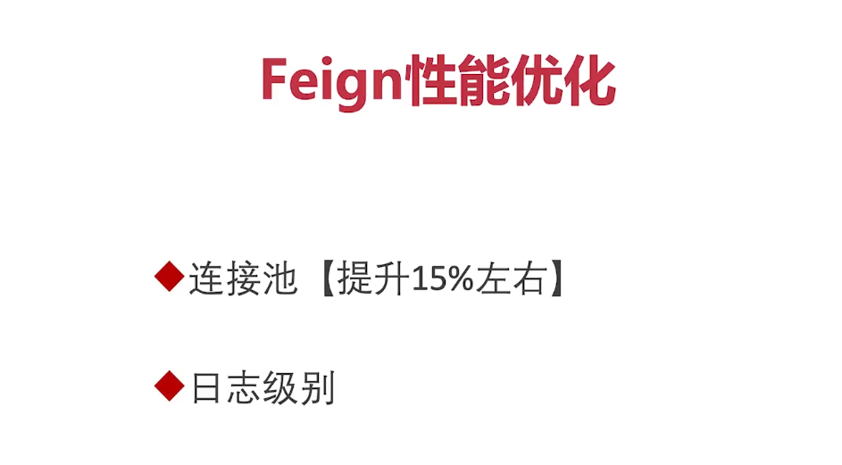

---

title: 7-13-Feign性能优化
date:
description: # 描述
tags: 
  - Spring Cloud alibaba 基础学习
---

暂无说明

<!-- more -->




## 优化方式一：配置连接池

#### 1. 添加依赖

````
<?xml version="1.0" encoding="UTF-8"?>
<project xmlns="http://maven.apache.org/POM/4.0.0"
         xmlns:xsi="http://www.w3.org/2001/XMLSchema-instance"
         xsi:schemaLocation="http://maven.apache.org/POM/4.0.0 http://maven.apache.org/xsd/maven-4.0.0.xsd">
    <modelVersion>4.0.0</modelVersion>

    <parent>
        <groupId>org.springframework.boot</groupId>
        <artifactId>spring-boot-starter-parent</artifactId>
        <version>2.1.5.RELEASE</version>
        <relativePath/> <!-- lookup parent from repository -->
    </parent>

    <groupId>com.zql.user-center</groupId>
    <artifactId>content-center</artifactId>
    <version>1.0-SNAPSHOT</version>

    <name>content-center</name>
    <description>Demo project for Spring Boot</description>

    <properties>
        <java.version>1.8</java.version>
    </properties>

    <dependencies>
        <dependency>
            <groupId>org.springframework.boot</groupId>
            <artifactId>spring-boot-starter-web</artifactId>
        </dependency>
        <dependency>
            <groupId>tk.mybatis</groupId>
            <artifactId>mapper-spring-boot-starter</artifactId>
            <version>2.1.5</version>
        </dependency>

        <dependency>
            <groupId>mysql</groupId>
            <artifactId>mysql-connector-java</artifactId>
            <scope>runtime</scope>
        </dependency>
        <dependency>
            <groupId>org.springframework.boot</groupId>
            <artifactId>spring-boot-starter-test</artifactId>
            <scope>test</scope>
        </dependency>
        <dependency>
            <groupId>org.projectlombok</groupId>
            <artifactId>lombok</artifactId>
            <version>1.18.8</version>
            <scope>provided</scope>
        </dependency>
<!--        spring-boot-starter-xxxx-->
<!--        xxxx-spring-boot-starter-->
<!--        spring-cloud-starter-{spring cloud子项目的名称}-[{模块名称}]-->
<!--        feign spring-cloud-starter-openfeign-->
<!--        sentinel spring-cloud-starter-alibaba-sentinel-->
        <dependency>
            <groupId>org.springframework.cloud</groupId>
            <artifactId>spring-cloud-starter-alibaba-nacos-discovery</artifactId>
        </dependency>

        <dependency>
            <groupId>org.springframework.cloud</groupId>
            <artifactId>spring-cloud-starter-openfeign</artifactId>
        </dependency>

        <!--   本次修改点     -->
        <dependency>
            <groupId>io.github.openfeign</groupId>
            <artifactId>feign-httpclient</artifactId>
        </dependency>
<!--        <dependency>-->
<!--            <groupId>org.apache.rocketmq</groupId>-->
<!--            <artifactId>rocketmq-spring-boot-starter</artifactId>-->
<!--            <version>2.0.3</version>-->
<!--        </dependency>-->
<!--        <dependency>-->
<!--            <groupId>org.springframework.cloud</groupId>-->
<!--            <artifactId>spring-cloud-starter-stream-rocketmq</artifactId>-->
<!--        </dependency>-->

<!--        <dependency>-->
<!--            <groupId>io.jsonwebtoken</groupId>-->
<!--            <artifactId>jjwt-api</artifactId>-->
<!--            <version>0.10.7</version>-->
<!--        </dependency>-->
<!--        <dependency>-->
<!--            <groupId>io.jsonwebtoken</groupId>-->
<!--            <artifactId>jjwt-impl</artifactId>-->
<!--            <version>0.10.7</version>-->
<!--            <scope>runtime</scope>-->
<!--        </dependency>-->
<!--        <dependency>-->
<!--            <groupId>io.jsonwebtoken</groupId>-->
<!--            <artifactId>jjwt-jackson</artifactId>-->
<!--            <version>0.10.7</version>-->
<!--            <scope>runtime</scope>-->
<!--        </dependency>-->

<!--        <dependency>-->
<!--            <groupId>com.github.binarywang</groupId>-->
<!--            <artifactId>weixin-java-miniapp</artifactId>-->
<!--            <version>3.5.0</version>-->
<!--        </dependency>-->

<!--        <dependency>-->
<!--            <groupId>org.springframework.boot</groupId>-->
<!--            <artifactId>spring-boot-starter-aop</artifactId>-->
<!--        </dependency>-->

<!--        <dependency>-->
<!--            <groupId>org.springframework.cloud</groupId>-->
<!--            <artifactId>spring-cloud-starter-zipkin</artifactId>-->
<!--        </dependency>-->

<!--        <dependency>-->
<!--            <groupId>org.springframework.boot</groupId>-->
<!--            <artifactId>spring-boot-starter-actuator</artifactId>-->
<!--        </dependency>-->
    </dependencies>

    <dependencyManagement>
        <dependencies>
            <!--整合spring cloud-->
            <dependency>
                <groupId>org.springframework.cloud</groupId>
                <artifactId>spring-cloud-dependencies</artifactId>
                <version>Greenwich.SR1</version>
                <type>pom</type>
                <scope>import</scope>
            </dependency>
            <!--整合spring cloud alibaba-->
            <dependency>
                <groupId>org.springframework.cloud</groupId>
                <artifactId>spring-cloud-alibaba-dependencies</artifactId>
                <version>0.9.0.RELEASE</version>
                <type>pom</type>
                <scope>import</scope>
            </dependency>
        </dependencies>
    </dependencyManagement>

    <build>
        <plugins>
            <plugin>
                <groupId>org.springframework.boot</groupId>
                <artifactId>spring-boot-maven-plugin</artifactId>
            </plugin>
            <plugin>
                <groupId>org.mybatis.generator</groupId>
                <artifactId>mybatis-generator-maven-plugin</artifactId>
                <version>1.3.6</version>
                <configuration>
                    <configurationFile>
                        ${basedir}/src/main/resources/generator/generatorConfig.xml
                    </configurationFile>
                    <overwrite>true</overwrite>
                    <verbose>true</verbose>
                </configuration>
                <dependencies>
                    <dependency>
                        <groupId>mysql</groupId>
                        <artifactId>mysql-connector-java</artifactId>
                        <version>5.1.22</version>
                    </dependency>
                    <dependency>
                        <groupId>tk.mybatis</groupId>
                        <artifactId>mapper</artifactId>
                        <version>4.1.5</version>
                    </dependency>
                </dependencies>
            </plugin>
        </plugins>
    </build>

</project>
````

#### 2. 修改配置文件

````
spring:
  datasource:
    url: jdbc:mysql://haike.myds.me:13911/content_center
    hikari:
      username: root
      password: root
      driver-class-name: com.mysql.cj.jdbc.Driver
  cloud:
    nacos:
      discovery:
        server-addr: haike.myds.me:13916
        # 修改为NJ
        cluster-name: NJ
        namespace: 46a69d7c-b8e4-4fa2-b906-a4cc49362120
        metadata:
          version: v1
          target-version: v1
  application:
    name: content-center

## 本次修改点
  main:
    allow-bean-definition-overriding: true

server:
  port: 9020


user-center:
  ribbon:
    NFLoadBalancerRuleClassName: com.netflix.loadbalancer.RandomRule


logging:
  level:
    com.zql.contentCenter.feignclient.UserCenterFeignClient: debug


feign:
  client:
    config:
      default:
        loggerLevel: full
  ## 本次修改点
  httpclient:
    # 让feign使用apache httpclient做请求；而不是默认的urlconnection
    enabled: true
    # feign的最大连接数
    max-connections: 200
    # feign单个路径的最大连接数
    max-connections-per-route: 50


````


