---

title: 8-05-流控规则
date: 
description: # 描述
tags: 
  - Spring Cloud alibaba 基础学习
---

暂无说明

<!-- more -->

## 1. 页面

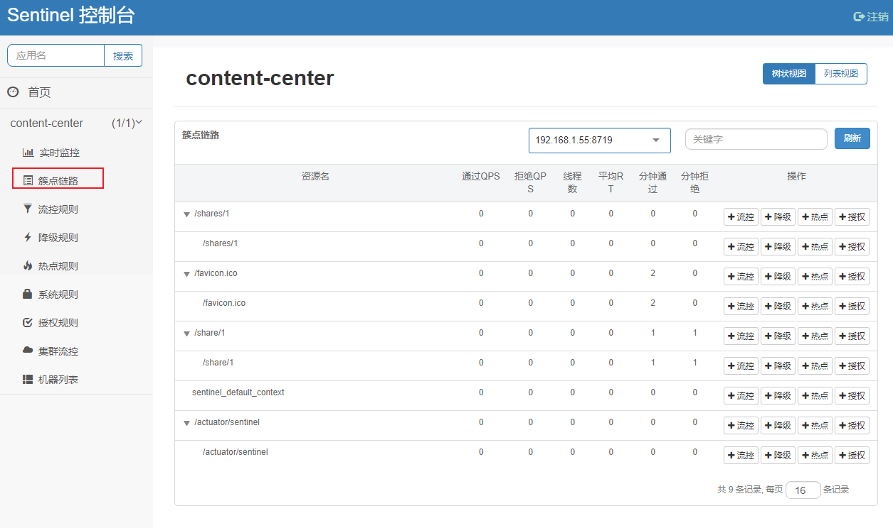

## 2. 流控模式一：直接

### 2.1 效果

接口达到限流条件时，直接限流；

### 2.2 单机阈值设为：1  每秒只允许访问一次

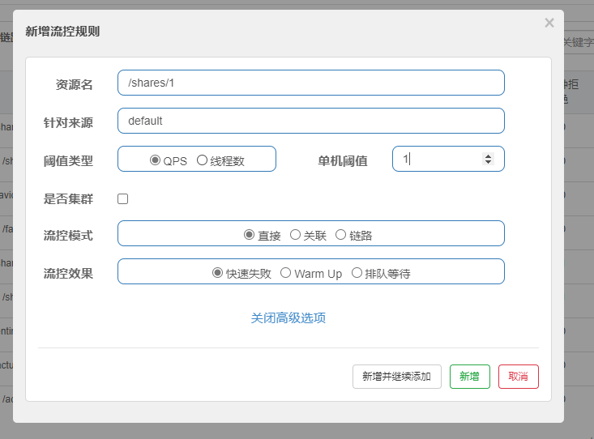

### 2.3 测试

#### 2.3.1 每秒访问次数超过2

````
http://127.0.0.1:9010/share/1
````

#### 2.3.2 查看效果

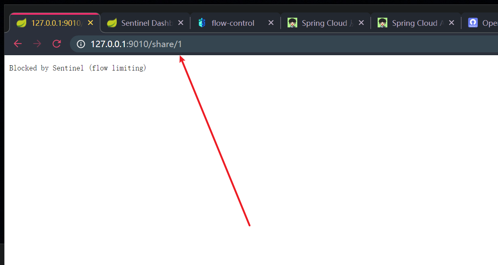

## 3. 流控模式二：关联模式

### 3.1 效果

当关联的资源达到阈值时，就限流自己；

### 3. 2 添加接口

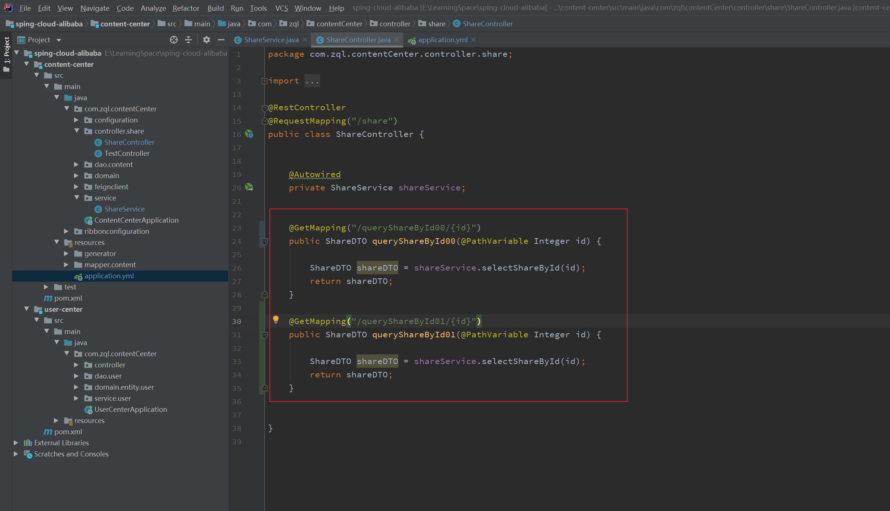


### 3.3 添加阈值

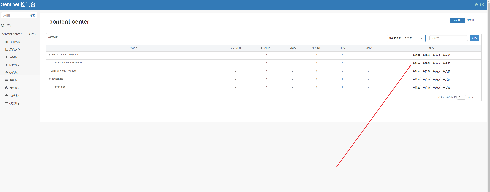

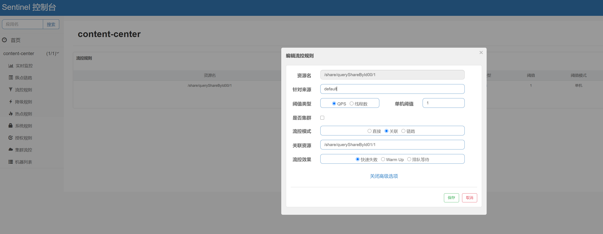


### 3.4 频繁访问queryShareById01接口

````
http://127.0.0.1:9010/share/queryShareById01/1
````

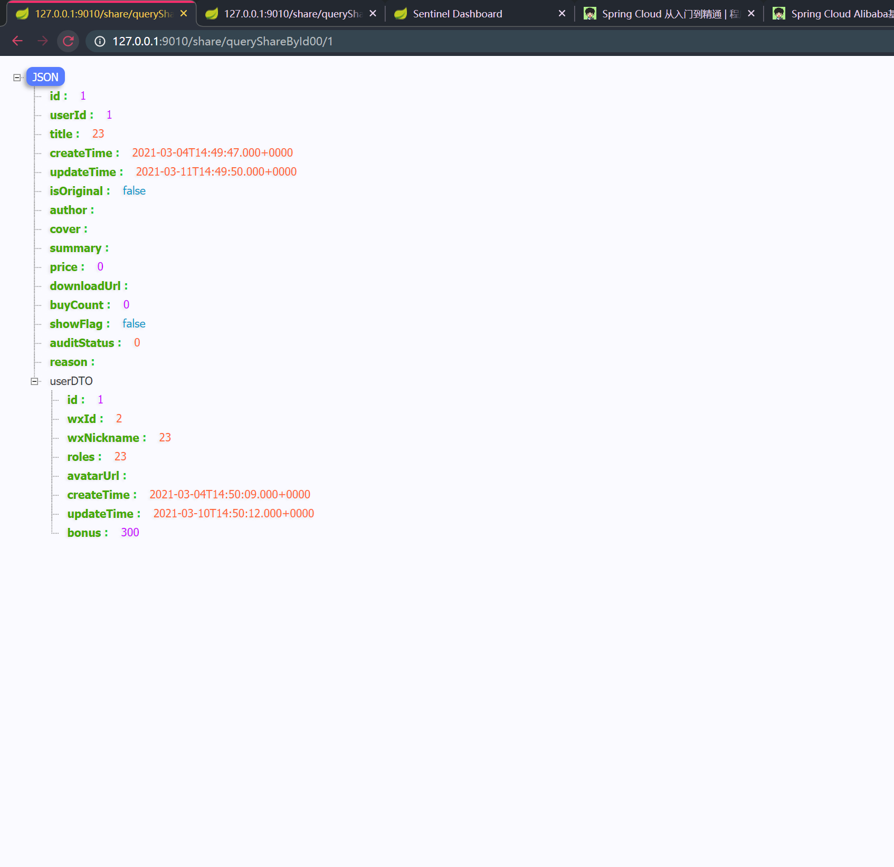

### 3.5 访问queryShareById00接口，被流控

````
http://127.0.0.1:9010/share/queryShareById00/1
````


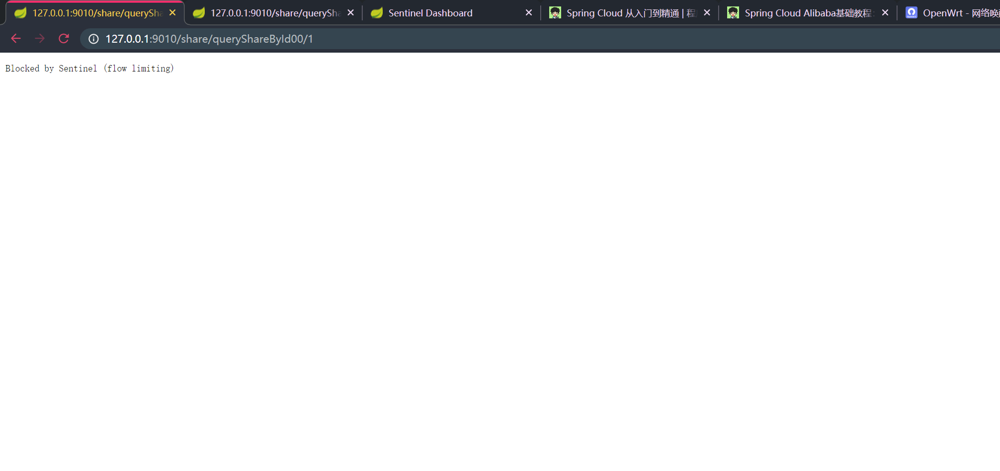

## 4. 流控模式三：链路模式

### 4.1 修改service

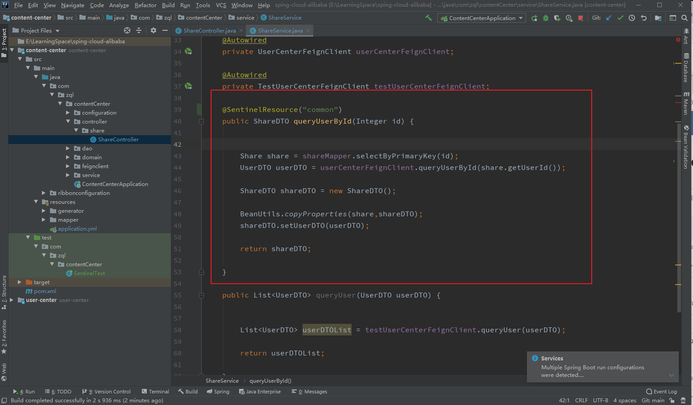

### 4.2 修改Controller

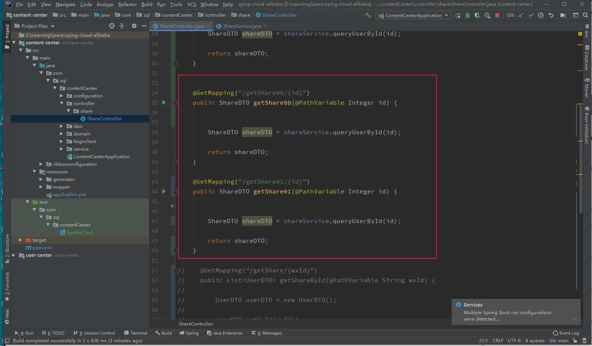

### 4.3 在common添加流控

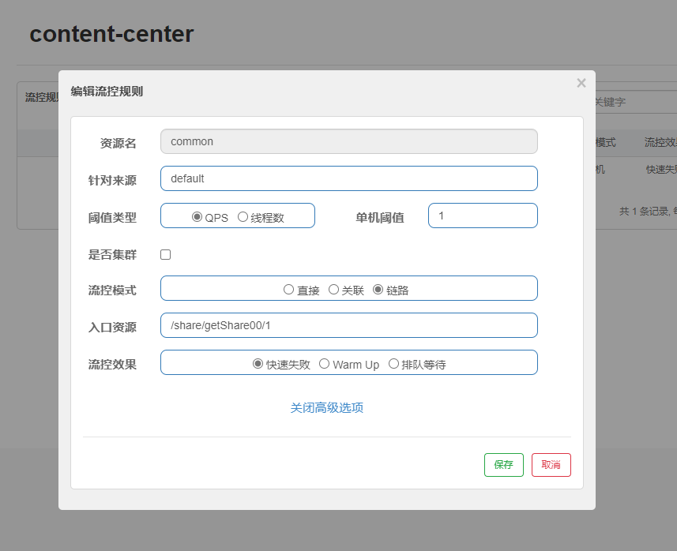

### 4.4 多次访问share/getShare00/1 会被限流

````
http://127.0.0.1:9020/share/getShare00/1
````

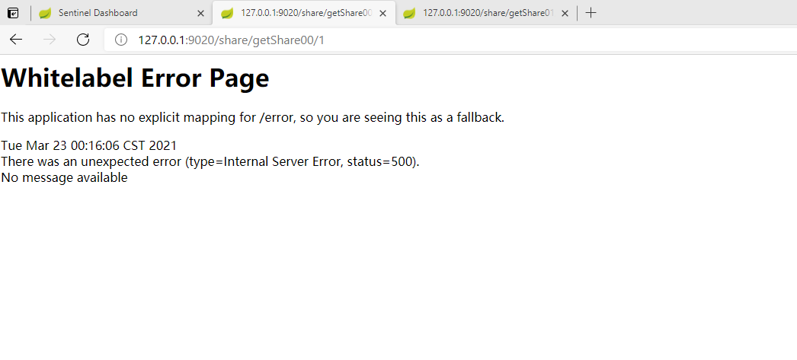

### 4.5 多次访问share/getShare01/1 不受影响

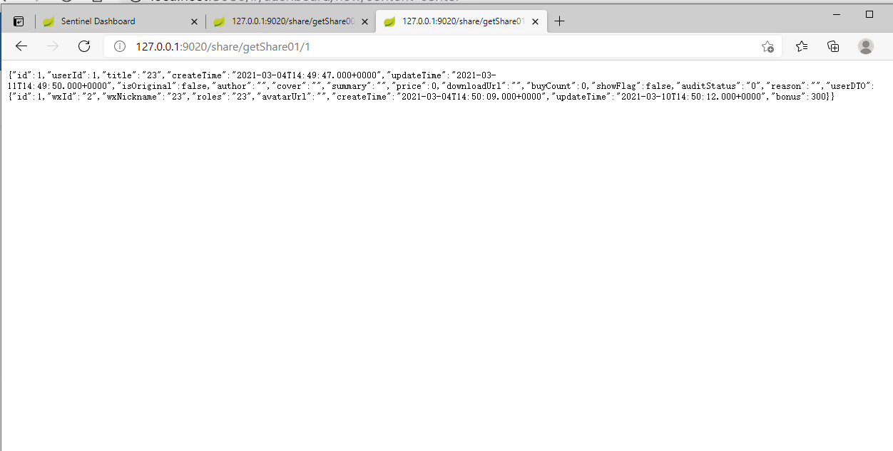


## 5. Sentinel流控模式

### 5.1 流控效果一： QPS直接失败

- 直接抛弃超过阈值的请求

### 5.2 流控效果二：Warm up

- 直接抛弃超过阈值的请求

### 5.3 流控效果三：排队等待

- 不会抛弃超过阈值的请求。会排队进行


## 6. 参考教程

- https://blog.csdn.net/Weixiaohuai/article/details/108370203