---

title: 8-13-SentinelAPI详解
date: 
description: # 描述
tags: 
  - Spring Cloud alibaba 基础学习
---

暂无说明

<!-- more -->

## 1. 测试Spu

### 1.1 关闭Sentinel对微服务的保护，以便测试

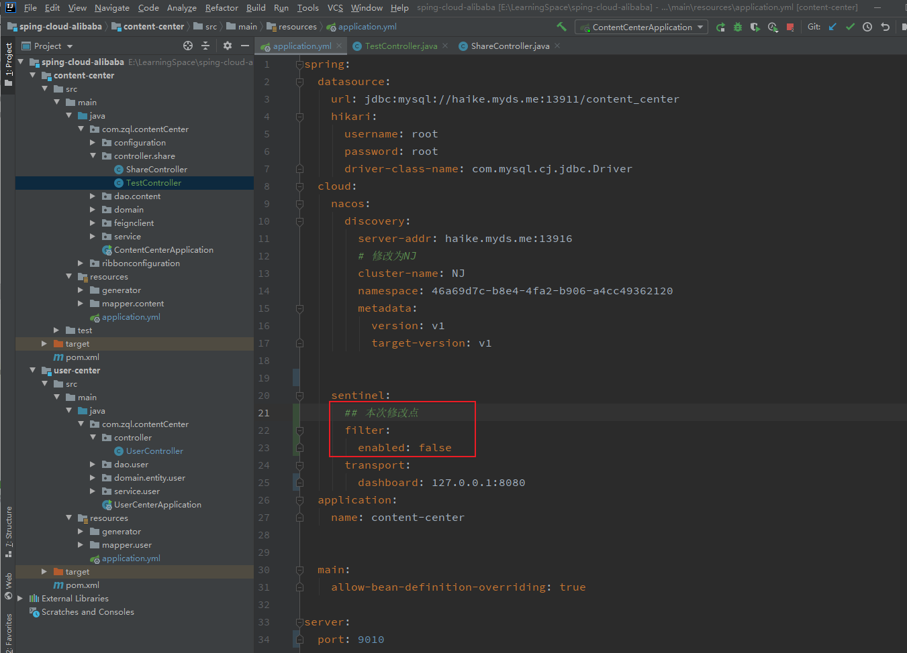


### 1.2 建立TestController

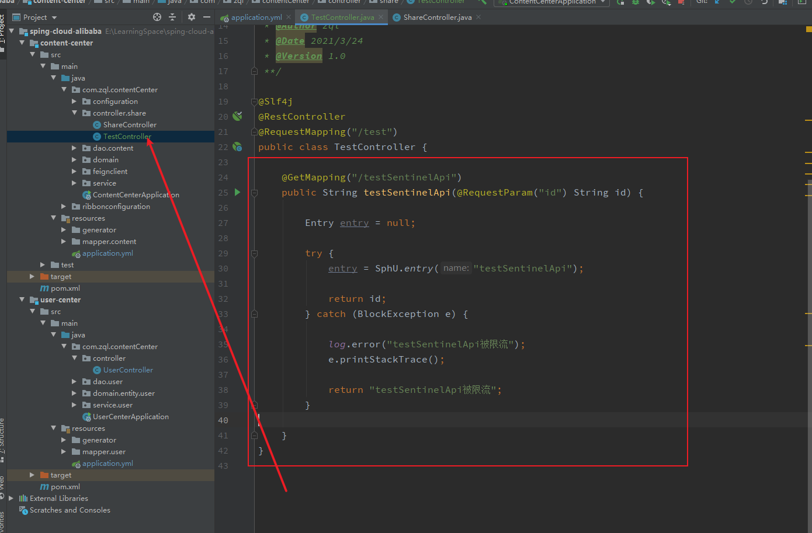

### 1.3. 添加请求流控

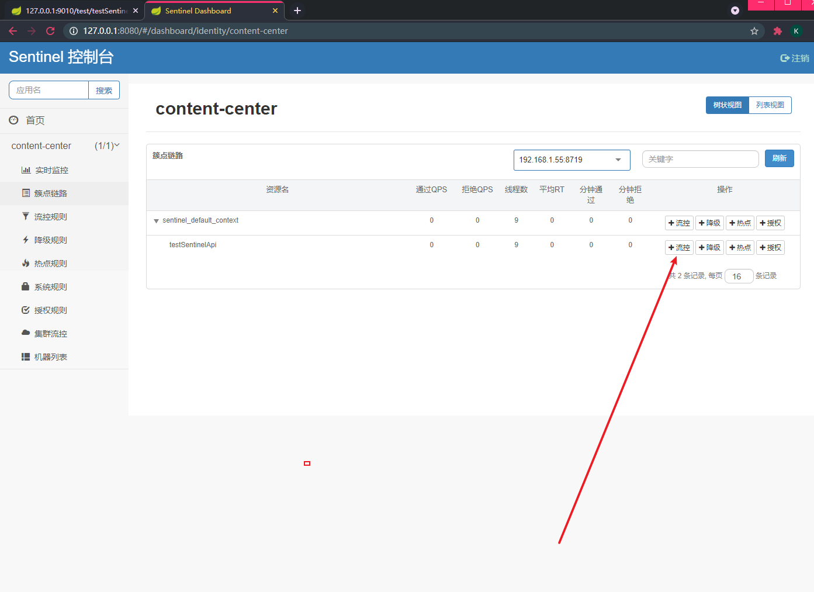

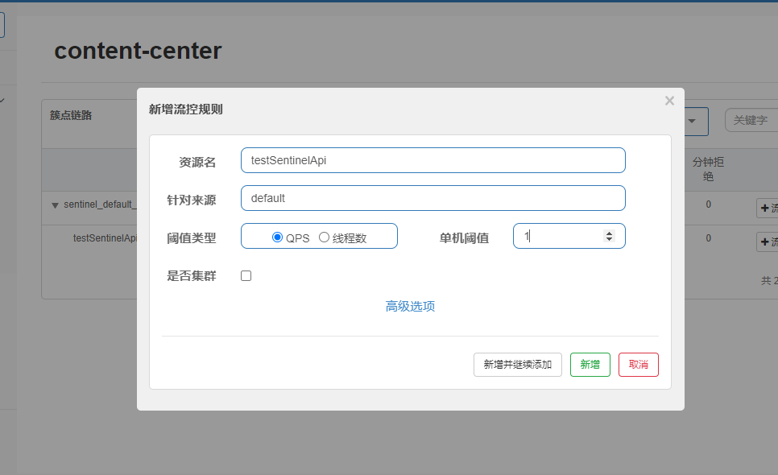

### 1.4. 查看测试结果

#### 1.4.1 多次请求http://127.0.0.1:9010/test/testSentinelApi?id=1

#### 1.4.2 查看结果

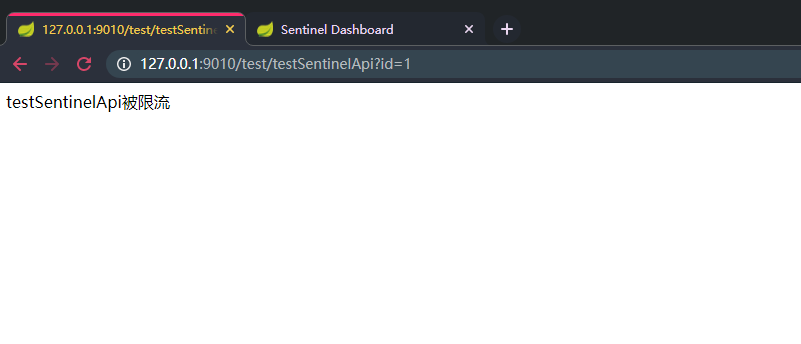

## 2. 测试Tracer

### 2.1 添加IllegalAccessException异常

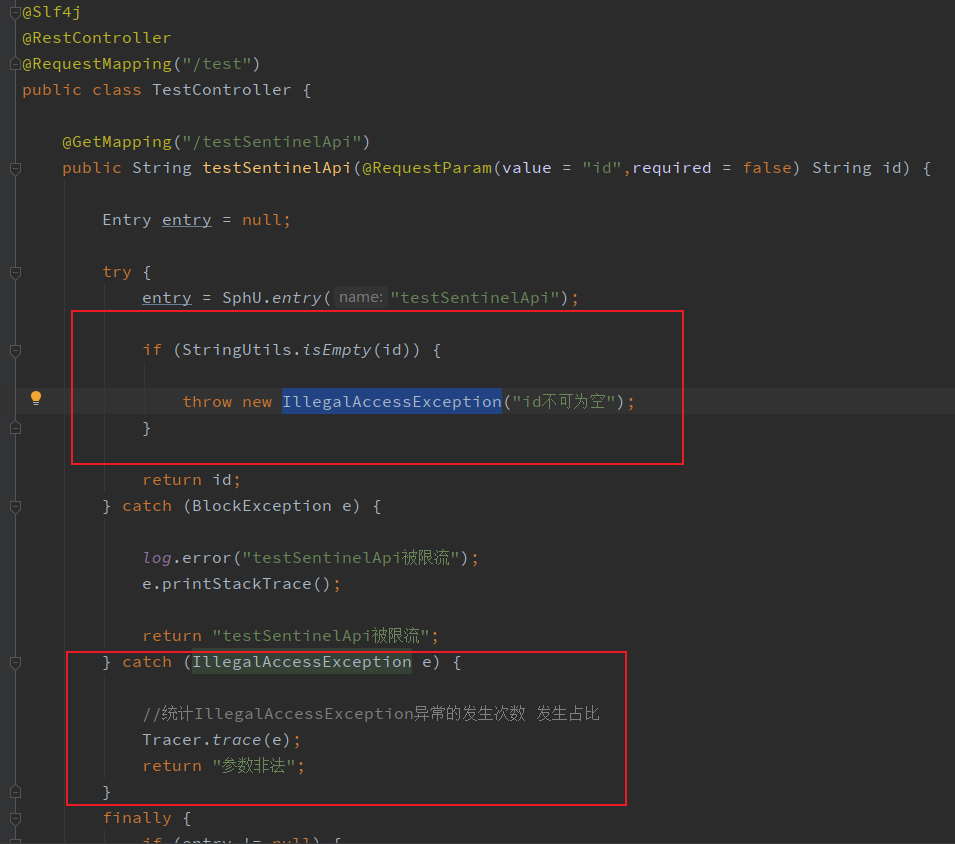

### 2.2 测试

#### 2.2.1 访问

````
http://127.0.0.1:9010/test/testSentinelApi
````

### 2.2.2 查看结果

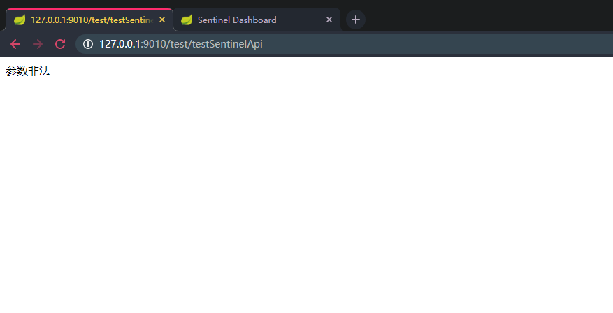

### 2.3 添加降级规则

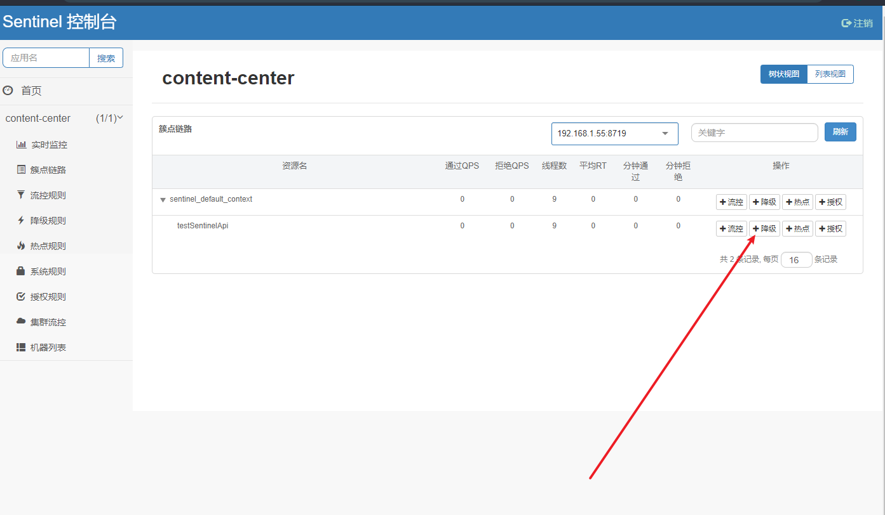

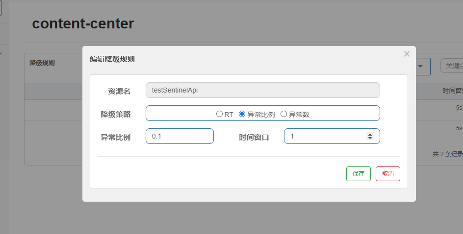

### 2.4 频繁访问

````
http://127.0.0.1:9010/test/testSentinelApi?id=1
````

### 2.5 查看结果

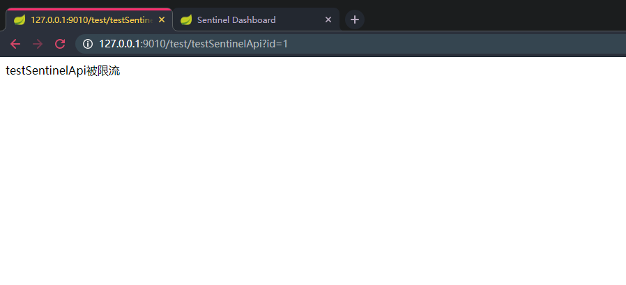

## 3. 测试CententUntil

### 3.1 指定来源

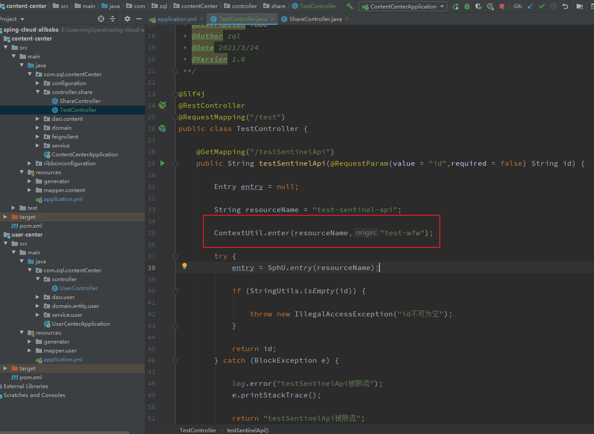

### 3.2 添加流控规则

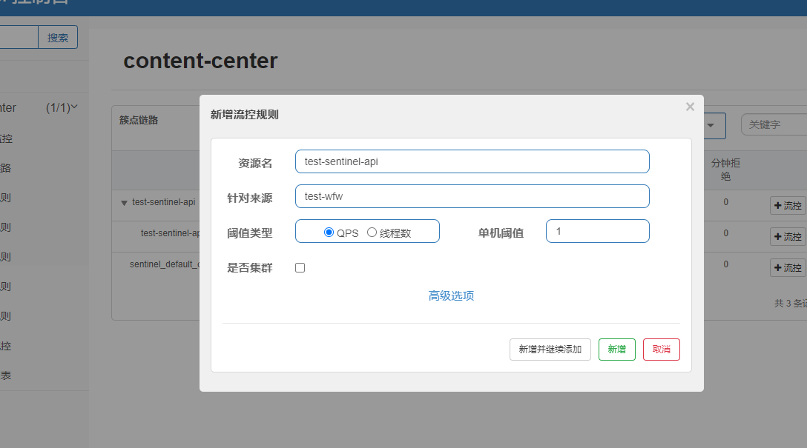

### 3.3 测试

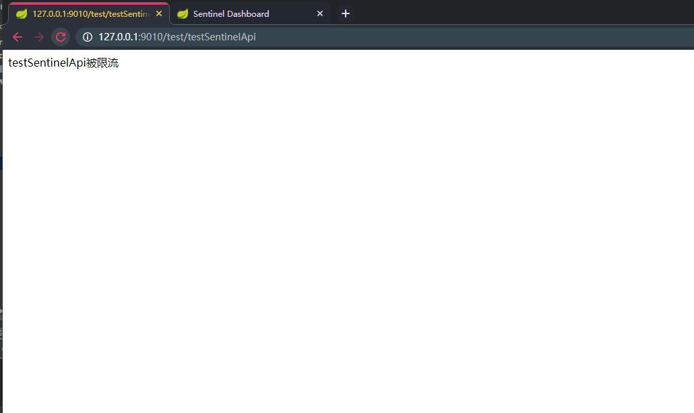

### 3.4 尝试指定其他来源

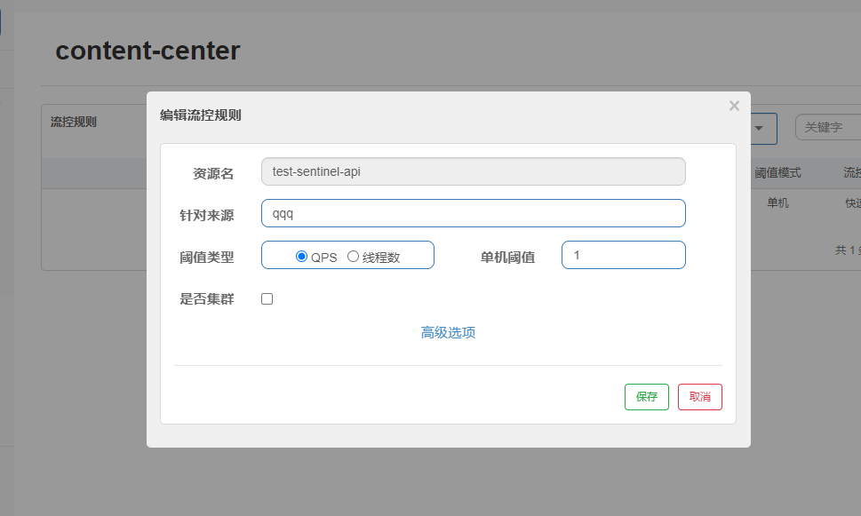

### 3.5 测试，未被限流

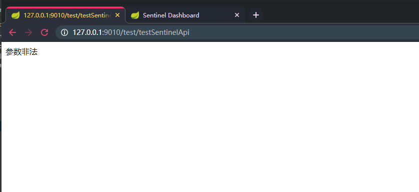

## ## 4总结Sentinel API

#### 4.1  API类型

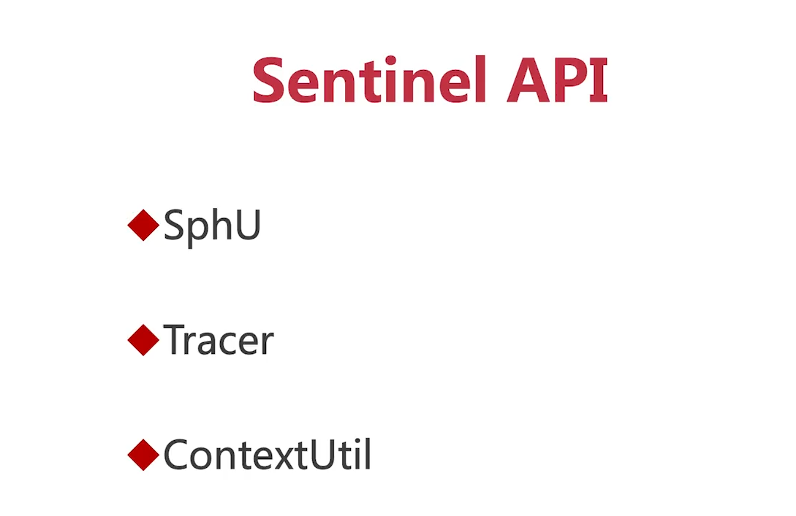

### 4.2 Sphu作用

定义监控资源，保护资源

### 4.2 Tracer 作用

对指定的异常进行统计

### 4.3 ContextUtil 作用

指定来源，标记调用